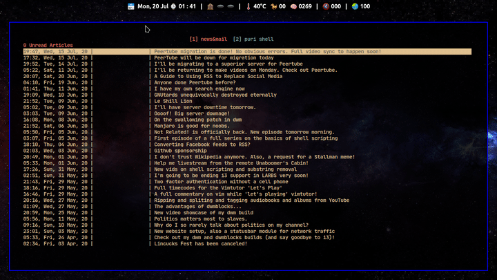

# puri: A minimal URL launcher for the command line interface

puri is a TUI for searching and launching URLs from a given file.

puri is written in ~100 lines of pure POSIX shellscript.

## Dependencies

-  grep, sed, sort, uniq, tr, wc, cut, stty, head, read

## Installation

```sh
git clone https://github.com/salman-abedin/puri.git && cd puri && sudo make install
```

## Usage

### Tmux

```sh
bind u run 'tmux capture-pane -C -J -S -1024 -E 1024 -p > /tmp/tb' \; \
  new-window -n puri 'puri /tmp/tb && rm -f /tmp/tb'
```

### Shell

```sh
puri [FILE...]
```

## Uninstallation

```sh
sudo make uninstall
```

## Similar Projects

-  [urlscan](https://github.com/firecat53/urlscan)
-  [urlview](https://github.com/sigpipe/urlview)

---

## Repos you might be interested in

[Bolt](https://github.com/salman-abedin/bolt)
: The lightning fast workflow creator

[Uniblocks](https://github.com/salman-abedin/uniblocks)
: The status bar wrapper

[Crystal](https://github.com/salman-abedin/crystal)
: The transparent setup

[Magpie](https://github.com/salman-abedin/magpie)
: The dotfiles

[Alfred](https://github.com/salman-abedin/alfred)
: The scripts

[Devour](https://github.com/salman-abedin/devour)
: Terminal swallowing

## Contact

SalmanAbedin@disroot.org
